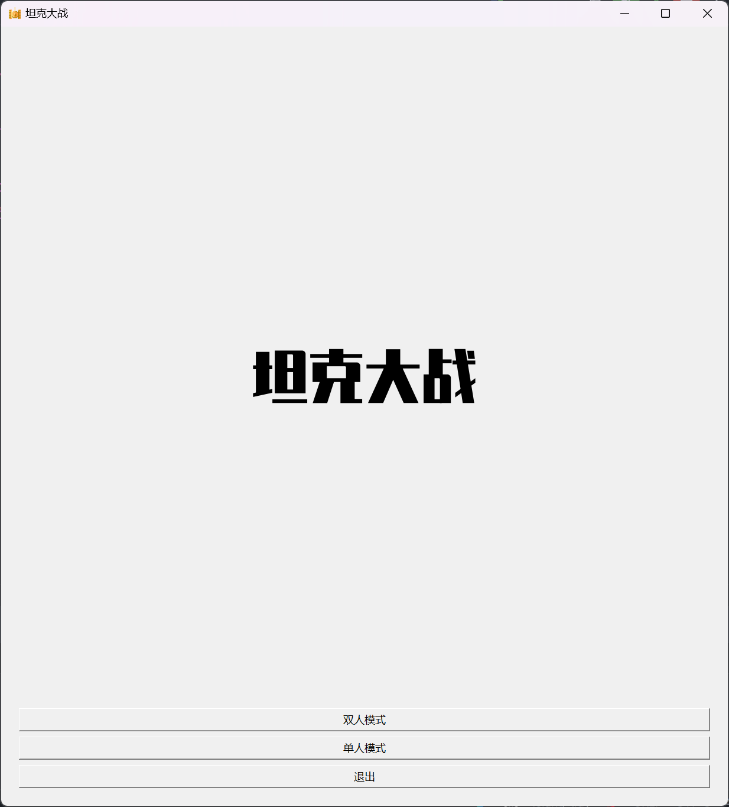
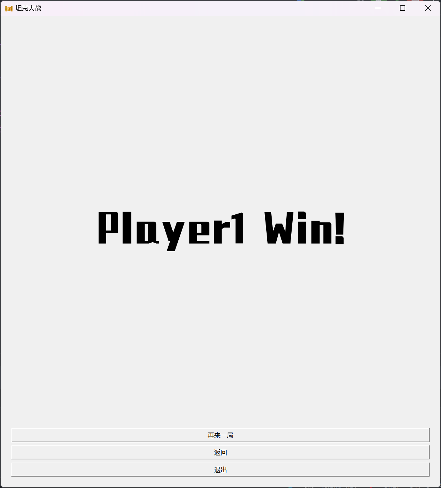
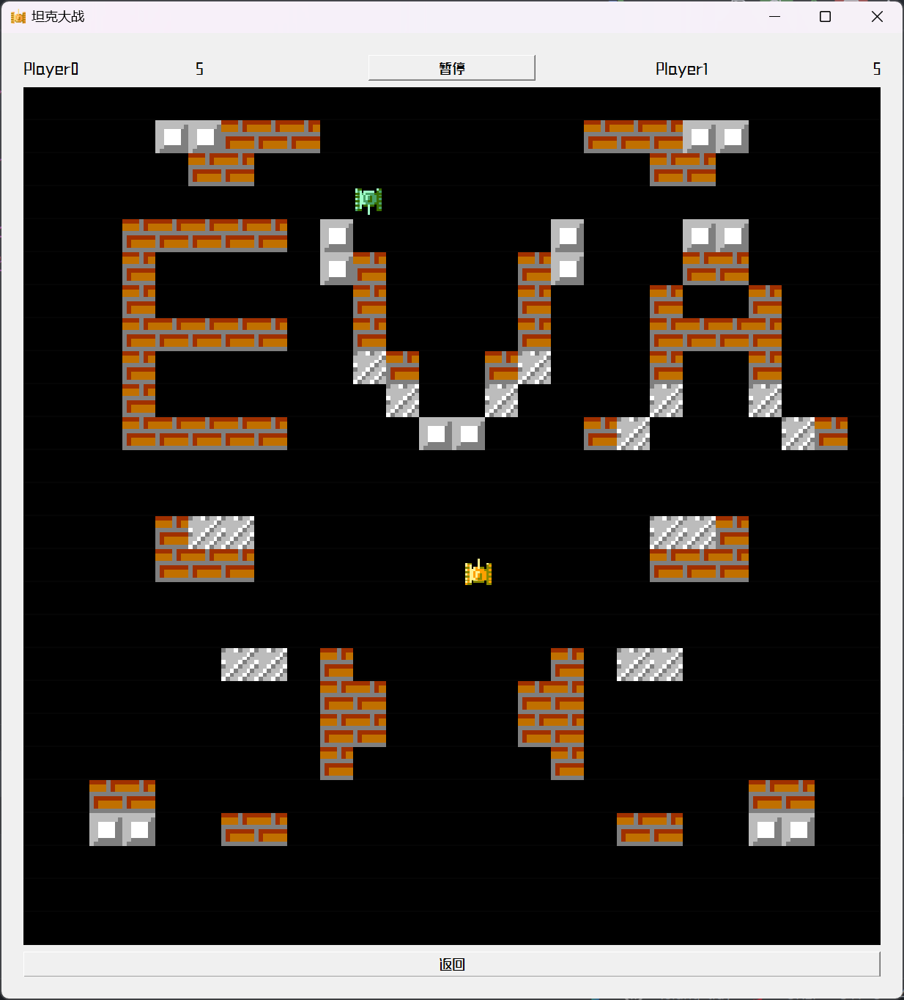
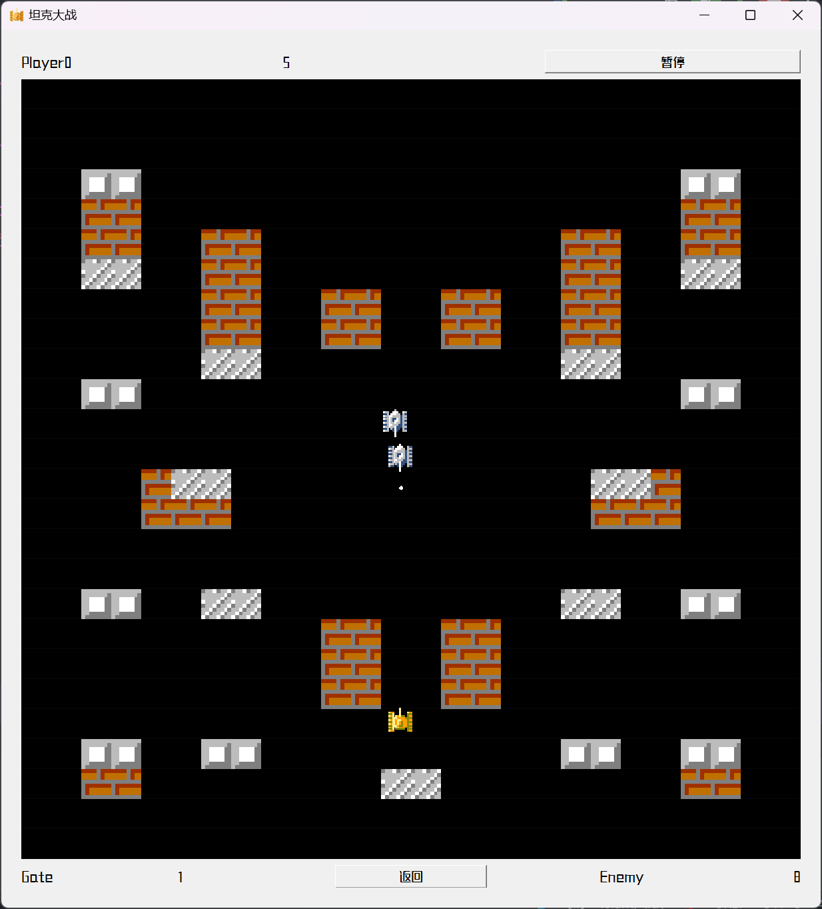

# 基本信息

## 开发环境

| 环境   | 版本            |
|------|---------------|
| 语言   | C++ 23        |
| 开发框架 | Qt 6.4.1      |
| 编译工具 | Cmake 3.25    |
| 编译器  | mingw_64      |
| 操作系统 | Windows 11    |
| IDE  | CLion2023.1.3 |

## 参考来源

- Qt 技术手册：[Qt Documentation | Home](https://doc.qt.io/)
- 图像资源： <https://github.com/zhouyumin/FC-tank>
- 坦克大战规则： [QT(C++)游戏之坦克大战（一）_c++ qt 坦克大战_chasentech的博客-CSDN博客](https://blog.csdn.net/qq_36327203/article/details/86326417)

# 背景

## 所学内容

- Qt 应用开发框架，如窗口，定时器，事件等
- C++面向对象编程，如类，继承，多态等
- 现代C++语法，如lambda表达式，模板等

## 应用场景

- 小游戏开发
- 试验AI算法

## 游戏规则

### 流程

- 游戏开始时，玩家选择单人或双人模式
- 游戏中，玩家可以选择暂停或退出游戏
- 游戏成功或失败时，玩家可以选择重新开始或退出游戏

### 双人模式

- 每名玩家各5条命，当玩家生命为0时，另一名游戏胜利

### 单人模式

- 玩家每关5条命，每关开始时生成3名敌人，之后每5s 生成一名敌人，击败10个敌人自动进入下一关
- 总共有3关，通过第3关时，游戏胜利
- 当玩家生命为0时，游戏失败

### 操作

- Player0由键盘 W、S、A、D 键控制移动方向，空格键发射子弹
- Player1由键盘上、下、左、右键控制移动方向，回车键发射子弹
- 敌方坦克自动追踪玩家并攻击

## 效果展示

- 可执行文件`Release/TankWar.exe`









# 代码

## 代码验证思路

- 通过游戏的运行结果来验证代码的正确性
- 图片显示正确
- 按钮功能正确
- 玩家坦克可以发射子弹、移动
- 敌方坦克有跟踪玩家的能力
- 结束时结果符合游戏规则

## 核心代码

### 类

| 类             | 父类            | 描述            | 属性                |
|---------------|---------------|---------------|-------------------|
| GameWidget    | QWidget       | 游戏窗口          | 定时器，玩家，敌人，当前模式，地图 |
| MainWidget    | QWidget       | 主窗口           | 按钮，游戏窗口           |
| MovableObject | QObject       | 可移动物体         | 碰撞体，速度，方向，阵营      |
| Bullet        | MovableObject | 子弹            | 图片，激活状态           |               |
| BulletSpeed   | Bullet        | 速度快的子弹        |                   |
| BulletATK     | Bullet        | 伤害高的子弹 (暂未实现) |                   |
| Tank          | MovableObject | 坦克            | 生命，子弹，履带状态，图片     |
| Player        | Tank          | 玩家坦克          | 移动状态              |
| Player0       | Player        | 默认玩家          |                   |
| Player1       | Player        | 玩家（双人模式）      |                   |
| Enemy         | Tank          | 敌方坦克          | 玩家的指针（用于自动追踪）     |
| EnemySpeed    | Tank          | 速度快的敌人        |                   |
| EnemyLife     | Tank          | 生命高的敌人        |                   |

### 全局参数

将全局参数声明在`Config.h`文件中，方便其他文件调用

- 全局常量：尺寸、属性
- 枚举类型: 方向、地形，可用`QmetaEnum`转换为字符串
- 全局函数:`bool empty()`

枚举量如下：

```cpp
//游戏阵营
enum class Camp {
Player0, Player1, Enemy
};

//人机模式和双人模式
enum class Mode {
Single, Double
};

//方向
enum Direction {
Up, Right, Down, Left
};

//地形
enum Terrain {
BLANK,
BRICK,
IRON,
ICE,
TANK,
};
```

### 地图

- 游戏界面用 `Map[780][780]` 来保存每个像素的物体，用于碰撞检测
- `TerrainMap[26][26]`来保存地形数据，用于界面绘制

```cpp
//检测矩形区域是否为空
bool empty(const QRect &rect) {
if (!scene.contains(rect)) {
return false;
}

for (int i = rect.top(); i <= rect.bottom(); i++) {
for (int j = rect.left(); j <= rect.right(); j++) {//只要有物体，就不为空
if (map[i][j] != Enum::BLANK) {
return false;
}
}
}

return true;
}

//设置矩形区域的地形
void setMap(const QRect &rect, Enum::Terrain terrain) {
for (int i = rect.top(); i <= rect.bottom(); i++) {
for (int j = rect.left(); j <= rect.right(); j++) {
map[i][j] = terrain;
}
}
}
```

### 按键检测

通过重载事件函数，对不同的按键进行不同的处理

``` cpp
//按下按键
void GameWidget::keyPressEvent(QKeyEvent *event) {

    //判断按键是否有效
    if (keyToDirectionPlayer0.contains((Qt::Key) event->key())) {
        //如果按下的是玩家0的方向键,则改变玩家0的方向
        player0->setDirection(keyToDirectionPlayer0.value((Qt::Key) event->key()));
        return;
    }

    if (event->key() == Qt::Key::Key_Space) {
        //如果按下的是空格键,则玩家1射击
        player0->shoot();
        return;
    }

    if (mode == Mode::Double) {

        if (keyToDirectionPlayer1.contains((Qt::Key) event->key())) {
            //如果按下的是玩家1的方向键,则改变玩家1的方向
            player1->setDirection(keyToDirectionPlayer1.value((Qt::Key) event->key()));
            return;
        }

        if (event->key() == Qt::Key::Key_Return) {
            //如果按下的是回车键,则玩家1射击
            player1->shoot();
            return;
        }
    }
}

//松开按键
void GameWidget::keyReleaseEvent(QKeyEvent *event) {

    if (keyToDirectionPlayer0.contains((Qt::Key) event->key()) && player0->getDirection() == keyToDirectionPlayer0.value((Qt::Key) event->key())) {
        //如果松开的是玩家0的方向键,且与当前方向匹配,则停止移动
        player0->stop();
        return;
    }

    if (mode == Mode::Double) {
        if (keyToDirectionPlayer1.contains((Qt::Key) event->key()) && player1->getDirection() == keyToDirectionPlayer1.value((Qt::Key) event->key())) {
            //如果松开的是玩家1的方向键,且与当前方向匹配,则停止移动
            player1->stop();
            return;
        }
    }

}
```

### 移动

1. 根据方向尝试移动自身的矩形碰撞体
2. 检测移动后所在区域的地图数组
3. 如果移动后超出边界或与其他碰撞体重叠，则返回原位置，否则移动成功
4. 注意更新地图数组

```cpp
//尝试移动
void MovableObject::tryMove() {
//根据方向和速度移动碰撞体
switch (direction) {
case Enum::Up:
collider.moveTop(collider.top() - speed);
break;

case Enum::Down:
collider.moveBottom(collider.bottom() + speed);
break;

case Enum::Left:
collider.moveLeft(collider.left() - speed);
break;

case Enum::Right:
collider.moveRight(collider.right() + speed);
break;
}
}

//移动
bool Tank::move() {
//复制一份碰撞体
QRect OldCollider = collider;
setMap(OldCollider, Enum::BLANK);

//尝试移动
MovableObject::tryMove();

//如果碰撞体未超出边界且未与其他碰撞体重叠，则移动
if (empty(collider)) {
setMap(collider, Enum::TANK);
return true;
} else {//否则，将碰撞体恢复到移动前的位置
collider = OldCollider;
setMap(collider, Enum::TANK);
return false;
}
}

//子弹移动类似，还会触发碰撞检测
void Bullet::move() {
if (active) {
MovableObject::tryMove();

//如果子弹超出边界或者与其他碰撞体重叠，则子弹消失
if (!scene.contains(collider, true)) {
active = false;
} else {
Enum::Terrain terrain = hasAttacked();
if (terrain != Enum::BLANK) {
active = false;
//子弹击中坦克后，触发坦克的攻击信号
if (terrain == Enum::TANK) {
emit attack(collider, camp);
}
}
}
}
}

//检测是否击中碰撞体
Enum::Terrain Bullet::hasAttacked() {
//遍历碰撞体
for (int i = collider.top(); i <= collider.bottom(); ++i) {
for (int j = collider.left(); j < collider.right(); ++j) {
if (map[i][j] != Enum::BLANK) {
if (map[i][j] == Enum::BRICK) {
//子弹击中砖块后，将砖块变为空地
setTerrainMap(j / BaseSize, i / BaseSize, Enum::BLANK);
//直接返回Enum::BRICK,如果是map[i][j]，则返回的是Enum::BLANK
return Enum::BRICK;
} else {
return map[i][j];
}
}
}
}

//如果子弹未击中任何碰撞体，则返回Enum::BLANK
return Enum::BLANK;
}
```

### 自动追踪

- 敌人可以通过玩家的指针来获取玩家的位置
- 敌人移动和射击时，通过和玩家的相对位置来决定移动方向

```cpp
bool Enemy::move() {
    if (QRandomGenerator::global()->bounded(4) < 1) {
        //25%的概率追踪玩家

        //directionX为敌人行走的垂直方向，directionY为敌人行走的水平方向，directionSpare来暂存备选方向
        Enum::Direction directionX, directionY, directionSpare;

        //获取玩家左上角和敌人的水平（垂直）对称轴的水平（垂直）距离
        const QRect &playerCollider = player->getCollider();
        int distanceX = collider.left() + collider.width() / 2 - playerCollider.left();
        int distanceY = collider.top() + collider.height() / 2 - playerCollider.top();

        if (distanceX > 0 && distanceX < collider.width()) {
            //如果敌人垂直的对称轴与玩家相交，则敌人向上(下)发动攻击能击中玩家，说明玩家进入敌人的垂直攻击范围
            //如果玩家纵坐标小于敌人的对称轴（在敌人的上方），则敌人方向调整为向上，否则向下
            direction = distanceY > 0 ? Enum::Up : Enum::Down;
            shoot();
            return Tank::move();
        } else if (distanceY > 0 && distanceY < collider.height()) {
            //玩家进入敌人的水平攻击范围
            //如果玩家横坐标小于敌人的对称轴（在敌人的左方），则敌人方向调整为向左，否则向右
            direction = distanceX > 0 ? Enum::Left : Enum::Right;
            shoot();
            return Tank::move();
        } else {
            //如果玩家没有进入敌人攻击范围，则确定玩家在敌人的哪个方向，然后敌人沿折线前进
            directionX = distanceX > 0 ? Enum::Left : Enum::Right;
            directionY = distanceY > 0 ? Enum::Up : Enum::Down;
            if (abs(distanceY) > abs(distanceX)) {
                //垂直距离更大，则垂直方向为首选方向，水平方向为备选方向
                direction = directionX;
                directionSpare = directionY;
            } else {
                //水平距离更大，则水平方向为首选方向，垂直方向为备选方向
                direction = directionY;
                directionSpare = directionX;
            }
            if (Tank::move()) {
                //如果朝首选方向移动成功，则不再朝备选方向移动
                return true;
            } else {
                //如果朝首选方向移动失败，则朝备选方向移动
                direction = directionSpare;
                return Tank::move();
            }
        }
    } else {
        //正常移动
        return Tank::move();
    }
}
```

### 碰撞检测

- 当子弹检测到地图为`Enum::TANK`时，说明子弹击中了坦克，然后遍历检测击中了哪个坦克
- 用`bool QRect::intersects(const QRect &r)`判断子弹和坦克的矩形矩形碰撞体是否相交，相交则说明子弹击中坦克

```cpp
//遍历每个坦克来碰撞检测
void GameWidget::collisionCheck(QRect &bulletCollider, Camp camp) {
//检查坦克是否在攻击范围内，是则被击中
if (player0->attacked(bulletCollider, camp)) {
return;
}

if (mode == Mode::Double) {
if (player1->attacked(bulletCollider, camp)) {
return;
}
} else {
for (auto &enemy: enemies) {
if (enemy->attacked(bulletCollider, camp)) {
return;
}
}
}
}

//坦克检测自己是否击中
bool Tank::attacked(QRect &bulletCollider, Camp camp) {
if (collider.intersects(bulletCollider)) {
//如果是不同阵营的子弹
if (this->camp != camp) {
//生命值减1
if (--life <= 0) {
emit die(this);
}

}
return true;
} else {
return false;
}
}
```

### 事件绑定

- 不同对象的事件可能有关联性，比如暂停按钮被点击时，会触发所有定时器的暂停
- Qt有信号槽机制，可以用函数`QMetaObject::Connection QObject::connect(const QtPrivate::FunctionPointer ::Object *sender, Func1 signal, const QtPrivate::FunctionPointer ::Object *receiver, Func2 slot, Qt::ConnectionType type = Qt::AutoConnection)`实现不同对象、不同函数的互相调用

以`玩家死亡->游戏结束->主窗口显示游戏结束`流程为例：

```cpp
//玩家死亡时，会触发die信号，然后调用endGame函数
connect(player0, &Player::die, this,[this] {
//玩家0死亡,游戏结束,玩家1或者敌人胜利
if (mode == Mode::Double) {
endGame(Camp::Player1);
} else {
endGame(Camp::Enemy);
}
});

//endGame函数会触发GameOver信号，然后调用GameOver函数
void GameWidget::endGame(Camp camp) {
endGate();

emit GameOver(camp);
}

//GameOver信号会触发主窗口的end函数
connect(ui->gameWindow, &GameWidget::GameOver, this, &MainWindow::end);
```

### 定时调用

- 游戏运行过程中有部分函数需要定时自动，如
	- 窗口刷新
	- 坦克、子弹移动
	- 生成敌人
- 只需定义相应的定时器，将定时器的`timeout()`信号与对应的槽函数绑定，即可实现定时调用

```cpp
//刷新定时器的timeout()信号和主窗口的update()槽函数绑定
connect(&updateTimer, &QTimer::timeout, this, qOverload<>(&GameWidget::update));

//开启定时器
updateTimer.start(UpdateInterval);//UpdateInterval为刷新间隔
```

## 编译和运行结果，验证结论

- 效果展示图见上文
- 可执行文件`Release/TankWar.exe`

## 案例分析

### 坦克移动时，会出现卡顿现象

定时器的刷新间隔设置得小一些

### QPixmap, QImage 不能加载 jpg 图像, 但是可以加载 bmp, png 图像

- 因为没有把支持相应格式的动态库放到程序运行目录
- 需要将 Qt 安装目录下的文件夹`imageformats` 复制到程序的运行目录。如将 `D:\Software\Qt\6.4.1\mingw_64\plugins\imageformats` 复制到工作目录`\cmake-build-debug`

```shell
<程序运行文件夹>
 - \*. exe
 - imageformats/\*. dll
```

### 关卡未开始时，mainWindow在按键事件中调用gameWidget的按键事件，使用了野指针player0，导致程序崩溃

在mainWindow的按键事件中，加入判断，只有在关卡开始后才调用gameWidget的按键事件